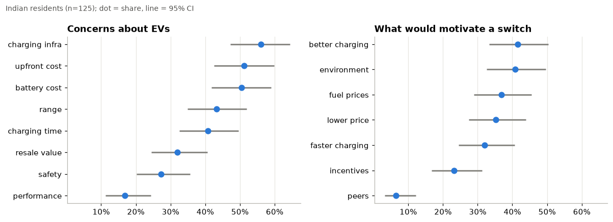

# Analyzing the Adoption of Electric Vehicles in the Indian Market

MS capstone project (MS in Data Science and Management, IIM Indore + IIT Indore), January–June 2025. Solo project, revised for publication.

**Notebook:** [`notebooks/ev_adoption_india.ipynb`](notebooks/ev_adoption_india.ipynb) · **Executive summary:** [`docs/executive_summary.pdf`](docs/executive_summary.pdf)

## The problem

India's EV registrations grew from about 2,400 in 2014 to 1.5 million in 2023, yet EVs are still a small share of new vehicles. The project asks:

1. **Market:** How fast is the market growing, in which segments and states, and how does India compare internationally?
2. **Consumers:** Among people living in India, how many intend to buy an EV next, what holds them back, and what distinguishes those who intend to buy?
3. **Economics:** Under what conditions does an electric car cost less to own than a petrol car?

## Data

| Dataset | Source | Role |
|---|---|---|
| Consumer survey (`data/survey_anonymised.csv`) | My own survey: 28 questions, Google Forms, June 2025; 204 usable responses | Intent, barriers, motivators |
| EV registrations by state × month × vehicle class, 2014 – Jan 2024 | [Kaggle: mafzal19](https://www.kaggle.com/datasets/mafzal19/electric-vehicle-sales-by-state-in-india) (described there as scraped from Clean Mobility Shift) | Trends, segments, states |
| EV registrations by manufacturer, 2015–2024 | [Kaggle: srinrealyf](https://www.kaggle.com/datasets/srinrealyf/india-ev-market-data) (upstream source not stated) | Brand concentration |
| Operational public charging stations by state | [Kaggle: srinrealyf](https://www.kaggle.com/datasets/srinrealyf/india-ev-market-data) (upstream source and date not stated) | Infrastructure vs adoption |
| Registered EVs by financial year, FY20–FY24 | [data.gov.in](https://www.data.gov.in/resource/year-wise-number-registered-electric-vehicles-e-vahan-portal-2019-20-2023-24) (Rajya Sabha Session 265, USQ 1355) | Cross-check of national totals |
| Registered EVs by state, as on 6 March 2023 | [data.gov.in](https://www.data.gov.in/resource/stateut-wise-details-registered-electric-vehicles-india-e-vahan-portal-ministry-road) (Rajya Sabha Session 259, USQ 3475) | Cross-check of state ranking |
| Global EV Outlook 2024 data | [IEA](https://www.iea.org/data-and-statistics/data-product/global-ev-outlook-2024) | International benchmark |

**Only the survey file is included in this repository.** The other six are fetched by `scripts/download_data.py` (see [Running it](#running-it) and [Data terms](#data-terms)).

The original project loaded 11 files. Five were loaded but never used in any analysis, and one appears to be synthetic. The notebook's Section 1 lists which files are used and why.

## Method

- **Survey.** The headline analysis covers the 125 respondents who are Indian residents *and* live in India. Every share is reported with a 95% Wilson confidence interval. Bivariate associations use chi-square tests with Holm correction. Purchase-intent models (logistic regression and random forest, on the same binary target and folds) are evaluated by 5-fold stratified cross-validation repeated 20 times, against a majority-class baseline, on three feature sets: full, demographic/behavioural only, and attitudes only. NRIs (n = 69) are compared separately.
- **Market.** Annual totals cover full years only (2014–2023). State growth rates are computed only where the 2019 base is at least 1,000 vehicles. Brand concentration uses the Herfindahl–Hirschman index (HHI).
- **Infrastructure.** One consolidated analysis: Pearson, Spearman and log–log correlation between state charging stations and 2023 registrations, after harmonising state names. K-means tiers are reported as a description only.
- **Forecasting.** Linear and log-linear trends are each backtested (fit 2014–21, predict 2022–23), and their implied 2024 growth is compared with January 2024 vs January 2023, the only 2024 month in the data.
- **Total cost of ownership.** Breakeven analysis with sensitivity tables over the price gap, annual distance and petrol cost per km.

## Findings

What the evidence supports, stated no more strongly than it allows:

1. **The market is large, still growing, and decelerating.** Registrations reached ~1.53M in 2023. Year-on-year growth fell from +209% (2022) to +49% (2023), and January 2024 was +39% on January 2023.
2. **India's EV market is two- and three-wheelers.** They were 94% of 2023 registrations. In electric *cars*, India is far behind: about 2% of new car sales, against 18% globally (IEA). Car-only benchmarks therefore understate India's overall transition.
3. **Adoption tracks charging infrastructure across states, but not causally.** The rank correlation is ρ ≈ 0.92, but state size confounds it and the direction of causation is unknown. States with far more EVs than their charger count would predict are e-rickshaw markets (UP, Bihar, Assam), which rely little on public charging.
4. **44% of surveyed Indian residents say their next vehicle is likely to be an EV** (95% CI 36–53%), and **38% are undecided**.
5. **Charging infrastructure (56%), upfront cost (51%) and battery replacement cost (50%) are the leading concerns.** Their confidence intervals overlap, so they cannot be ranked against each other. **Home is the preferred charging location (64%).**
6. **Demographics do not predict purchase intent in this sample.** Demographic-only models score ROC AUC ≈ 0.51, no better than chance. All of the predictive signal comes from overall opinion and familiarity, which are close to restating intent.
7. **NRIs and residents show the same intent** (48% vs 44%, Fisher p = 0.65).
8. **EV vs petrol-car economics turn on usage and the price gap.** Under the stated assumptions (₹4L price gap, 12,000 km/yr), the EV breaks even after about 5.2 years. At 20,000 km/yr it breaks even after about 3.2 years. At 12,000 km/yr it pays back within 5 years whenever the gap is below ~₹3.9L.

<p align="center">
  
</p>

## Limitations

- **Convenience sample.** Respondents came through personal networks over about 20 hours. The sample skews towards Kerala, the Gulf diaspora, women (61%) and graduates (94%). Results describe these respondents, not Indian consumers.
- **Self-reported intent.** Stated intent to buy usually overstates actual purchases.
- **Small n.** With 125 Indian residents, a share has an uncertainty of about ±9 points, and subgroup differences under ~20 points cannot be reliably detected.
- **No causal claims.** Every relationship reported is an association.
- **Data gaps.** Telangana is missing from the registration data. The charger data has no stated source or snapshot date. The IEA data excludes two- and three-wheelers.
- **TCO is illustrative.** Resale value, battery replacement, insurance, financing and discounting are not modelled.
- **Anonymisation costs some detail.** See below.

## What changed from the original capstone

The re-analysis found errors in the original notebook. They are corrected here, and the affected conclusions are withdrawn:

| Original result | Problem | Now |
|---|---|---|
| EV stock CAGR: India −37.7%, USA 0.0% | The IEA filter didn't select `mode` or `powertrain`, so `.values[0]` picked an arbitrary row per year (bus in one year, car in another) | Cars only, BEV+PHEV summed: India 55.5%, USA 36.4% (2015–23) |
| Linear forecast: 882,017 EVs in 2025 (below 2023 actual) | Fitted on January 2024 as if it were a full year | Partial year excluded. Linear and log-linear both shown and backtested; their implied 2024 growth (−28% and +106%) brackets the +39% January signal by a wide margin; **neither is reliable**, so no point forecast is claimed |
| ARIMA(2,1,2) forecast | 5 parameters on 10 observations; the fit did not converge | Removed (explanation in notebook §8) |
| Logistic regression "75.6% accuracy" | Single 41-row holdout; baseline was 55.6% | Repeated cross-validation, with the baseline reported |
| "Very positive opinion" as the top driver | Close to circular | Re-run without attitudes: demographics carry no signal |
| RandomForest 39% vs LR 75.6% | 5-class vs binary target; not comparable | Same target, features and folds: the models are equivalent |
| "EV costs ₹34,000 more over 5 years" | Maintenance defined but unused; result driven by the assumed price gap | Breakeven and sensitivity analysis |
| NRIs and foreign residents in the headline numbers | Mixed markets | Indian residents living in India only; NRIs compared separately |
| Charging regression ×3, clustering ×2, merge ×2 | Duplication; merge silently dropped mismatched state names; missing stations zero-filled | One pass, names harmonised, no zero-filling |
| "4W" brand chart empty | Dataset labels cars `LMV` | Fixed |
| Ladakh "infinite" CAGR at the top of the state ranking | Growth from a base of zero | Only states with a 2019 base ≥ 1,000 are ranked |

## Survey anonymisation

The raw survey export is **not** published. `scripts/anonymise_survey.py` builds `data/survey_anonymised.csv` as follows:

- Drops timestamps and every free-text answer. The location question was free text and contained village and building names; it is replaced by a coarse region.
- Coarsens age, income, education and employment, and replaces nationality with residential status.
- Turns multi-select questions into 0/1 flags for the predefined options only.
- Removes one respondent who reported being under 18.
- Applies local suppression until every combination of age band, gender, India/abroad, region and employment is shared by at least 3 respondents. As a result, employment is suppressed in 50 rows, region in 40 and age band in 14.
- Shuffles rows and assigns random IDs.

## License

The **code** in this repository (the notebook's code cells and everything in `scripts/`) is released under the [MIT License](LICENSE).

The MIT License does **not** cover the data. The anonymised survey file and the written documents in `docs/` are my own work and are not licensed for reuse beyond viewing.

## Data terms

The third-party datasets are not mine to license, and they are **not redistributed** here: `scripts/download_data.py` fetches them from their sources. Their terms are set by their publishers, and anyone using them must follow those terms. The table below records what I could and could not confirm when preparing this repository. **Check each source page before reusing the data.**

| Source | Terms as published by the source | Confirmed? |
|---|---|---|
| [Kaggle: mafzal19](https://www.kaggle.com/datasets/mafzal19/electric-vehicle-sales-by-state-in-india) | Search listings show CC0 (public domain). The Kaggle page describes the data as scraped from the Clean Mobility Shift website, whose own terms are unknown. | No; source page not reachable at time of checking |
| [Kaggle: srinrealyf](https://www.kaggle.com/datasets/srinrealyf/india-ev-market-data) | No licence found | No |
| [data.gov.in](https://www.data.gov.in/) (two Rajya Sabha answer datasets) | Published on the Open Government Data Platform India under the National Data Sharing and Accessibility Policy; see the platform's terms of use. | No; resource pages not reachable at time of checking |
| [IEA Global EV Outlook 2024 data](https://www.iea.org/data-and-statistics/data-product/global-ev-outlook-2024) | Search listings show CC BY 4.0 (reuse with attribution). | No; source page not reachable at time of checking |

If you reuse results derived from these datasets, attribute the original publishers as linked above.

## Repository layout

```
├── notebooks/ev_adoption_india.ipynb   # the analysis, executed, with narrative
├── data/
│   ├── survey_anonymised.csv           # published survey data
│   ├── external/                       # gitignored: third-party data, fetched by download_data.py
│   └── raw/                            # gitignored: raw survey export
├── scripts/
│   ├── download_data.py                # fetch + checksum-verify third-party data
│   ├── anonymise_survey.py             # raw survey -> anonymised CSV
│   └── export_figures.py               # notebook figures -> docs/figures/
├── docs/
│   ├── executive_summary.pdf / .html   # two-page business summary
│   ├── interview_notes.md              # talking points
│   └── figures/
├── LICENSE                             # MIT, code only
└── requirements.txt
```

## Running it

```bash
python -m venv .venv && source .venv/bin/activate
pip install -r requirements.txt
python scripts/download_data.py   # see below
jupyter nbconvert --to notebook --execute --inplace notebooks/ev_adoption_india.ipynb
```

`download_data.py` fetches the Kaggle files automatically if you have a [Kaggle API token](https://www.kaggle.com/docs/api). The two data.gov.in files and the IEA file must be downloaded from the linked pages; the script prints the links and the exact filenames to save under `data/external/`. It then checks every file against the SHA-256 of the version this analysis used, and warns if a source has changed since.

To rebuild the anonymised survey file, place the raw export at `data/raw/EV Adoption Survey (Responses).xlsx` and run `python scripts/anonymise_survey.py`. Small localities named by respondents are mapped by a private `data/raw/location_overrides.json`, which is also not published; without it they fall into "Unclear".
